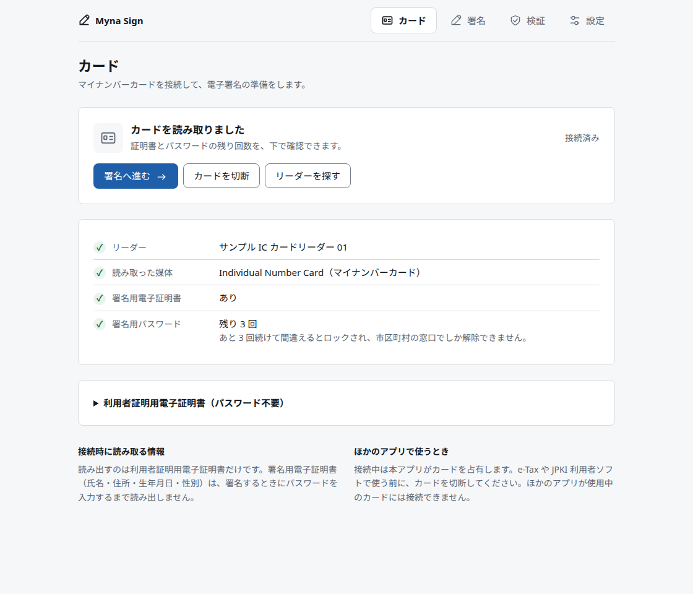
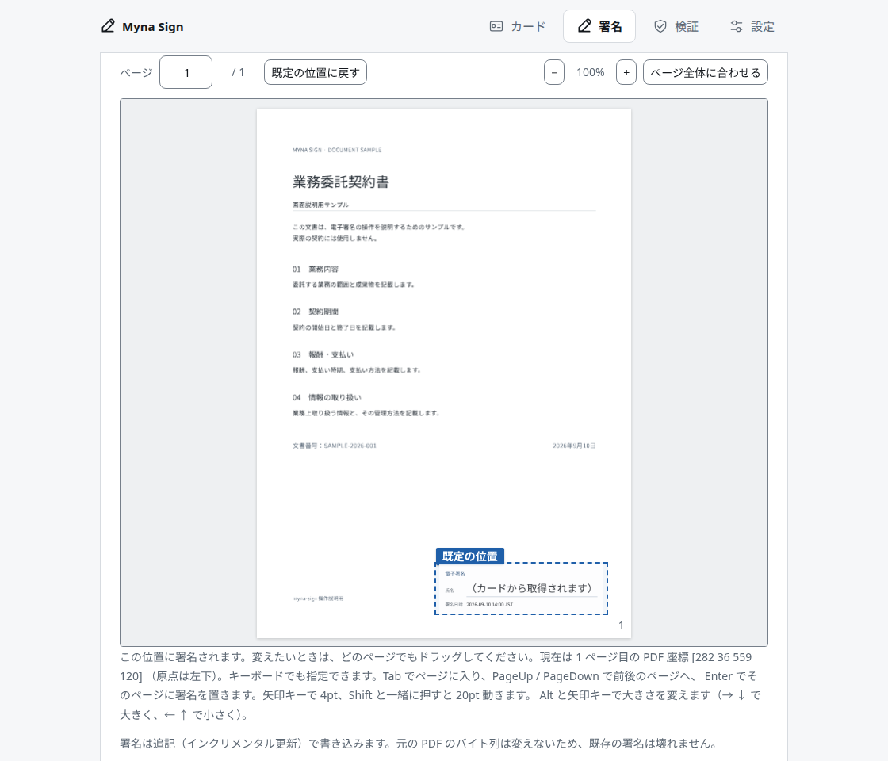
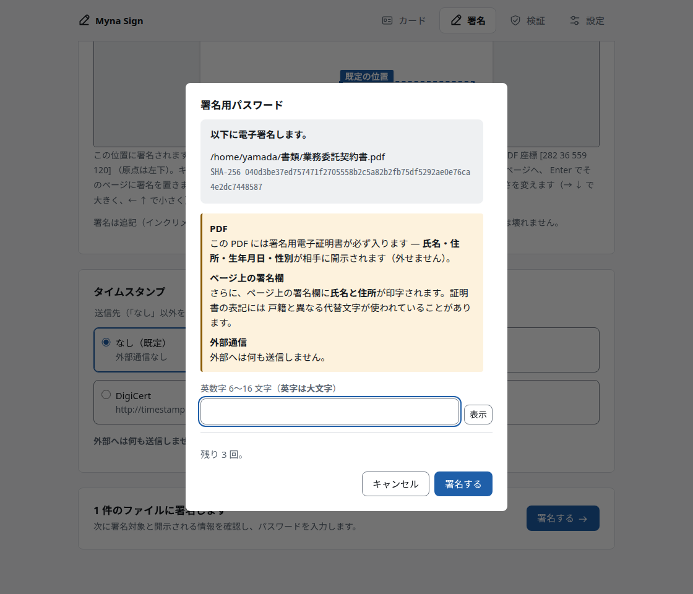
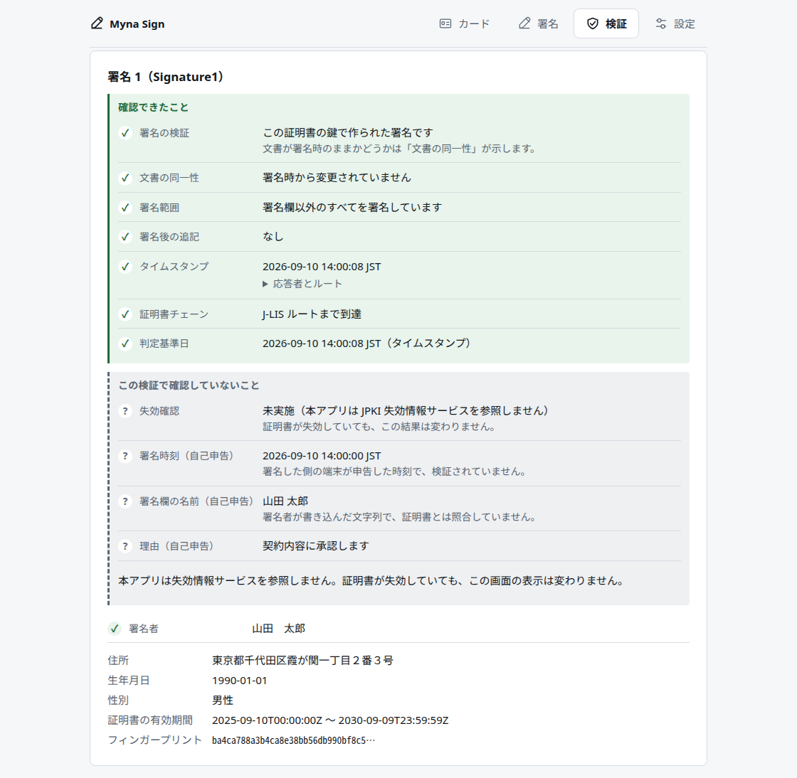
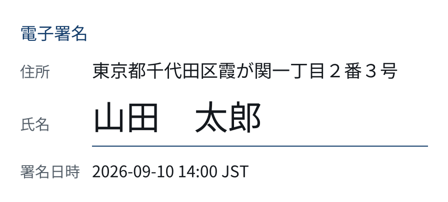

# myna-sign

マイナンバーカードの **署名用電子証明書** で、任意のファイルや PDF に電子署名を付与し、検証するデスクトップアプリケーション。

- 任意のファイル → OpenPGP 分離署名 (`.asc`)、テキストならクリアテキスト署名も
- PDF → 追記署名 (`adbe.pkcs7.detached`)、署名欄は自動生成 (任意の画像も可)
- RFC 3161 タイムスタンプ (なし / FreeTSA / DigiCert / 任意サーバ)

## 画面

### カード

接続時に読み出すのは利用者証明用電子証明書だけ。基本4情報を含む署名用電子証明書は、
署名するときにパスワードを入力するまで読み出さない。残り回数を常に出すのは、5 回間違えると
ロックされ、市区町村の窓口でしか解除できなくなるため。



### 署名 (PDF)

署名欄はドラッグで置ける。破線の枠は「何も置かなければここに署名される」という既定位置で、
自分で置いた位置とは見分けがつくようにしてある。枠の中身は、実際に PDF へ描かれるものと同じ。



### 署名する前に

パスワードを送る前に、**何に署名するのか** (ファイル名と SHA-256) と、**その署名が何を渡すことに
なるのか** (基本4情報の開示、外部への送信先) を出す。ここにも残り回数を出し、次が最後の 1 回なら
確認を挟む。



### 検証

一行の「有効」は出さない。**確認できたこと**と**確認していないこと**を分けて並べる。
本アプリは失効情報サービスを参照しないので、「失効確認: 未実施」は常に出る。



### 自動生成される署名欄

画像を用意しなければこれが描かれる。住所と氏名は証明書から取る (`/Location` ではない)。
囲み枠を描かないのは、それがビューアの「検証済み」表示だから。これは署名時に描く絵であって、
何も検証していない。



## 構成

```
src/                     署名・検証ライブラリ
src/card.rs              PC/SC、CardSigner、セッション管理
src/bin/cli.rs           myna-sign CLI
tests/                   相互運用・CLI・実カードのテスト
src-tauri/               Tauri アプリ
ui/                      Preact + Vite
assets/                  組み込み証明書とフォント
```

ルートの `myna-sign` パッケージがライブラリと CLI を持ち、`src-tauri` は同じ Cargo workspace の
アプリケーションメンバーになっている。Cargo の依存解決、`Cargo.lock`、`target/` はルートで一元管理する。

署名形式のコードがカードについて知っているのは `DigestSigner` trait 一つだけで、その中身は
「32 バイトの SHA-256 を渡すと 256 バイトの署名が返る」に尽きる。カード処理を同じパッケージの
`card` モジュールへまとめてもこの境界は変わらず、OpenPGP・CMS・PDF・RFC 3161 はカードなしで
テストできる。

## 必要なもの

| | |
|---|---|
| Rust | 1.88 以降 |
| Node.js | 20 以降 |
| PC/SC | Linux: `pcscd` + `libpcsclite1` (ビルド時 `libpcsclite-dev`) / macOS・Windows: OS 内蔵 |
| WebView | Linux: `libwebkit2gtk-4.1-dev`, `libgtk-3-dev`, `libsoup-3.0-dev` / macOS: 内蔵 / Windows: WebView2 |

対象は Linux (x86_64)、macOS (Apple Silicon)、Windows (x64)。

## ビルド

```sh
# ライブラリと CLI。テストにカードもリーダーも要らない。
cargo test

# GUI
npm ci --prefix ui
npm --prefix ui run build
cargo build --release -p myna-sign-app --features custom-protocol
```

`--features custom-protocol` は省略できない。これが無いと Tauri はフロントエンドを
バイナリに埋め込まず、`build.devUrl` (localhost:5173) を見に行くので、
開発サーバを動かしていない環境では「Connection refused」しか出ない。
`cargo tauri build` を使う場合は自動で付く。

開発中は Tauri CLI から Vite とアプリケーションをまとめて起動する:

```sh
npm exec --prefix ui -- tauri dev
```

## 使ってみる (カードなし)

`--soft-key` はその場で作った使い捨ての RSA 鍵で署名する。パイプライン全体を確認するためのもので、
できあがる署名は誰のことも証明しない。

```sh
cargo build --bin myna-sign

# 任意ファイル → .asc と公開鍵
./target/debug/myna-sign --soft-key sign contract.txt --public-key
./target/debug/myna-sign verify contract.txt.asc contract.txt

# 本文と署名を 1 ファイルに (テキストのみ)。原本を渡す必要がない。
./target/debug/myna-sign --soft-key sign contract.txt --cleartext
./target/debug/myna-sign verify contract.txt.asc

# PDF → タイムスタンプ付き署名。住所・氏名・日時を記した署名欄が自動で描かれる。
./target/debug/myna-sign --soft-key --tsa digicert sign-pdf contract.pdf --reason 承認

# 自分の印影を使う / ページに何も出さない
./target/debug/myna-sign --soft-key sign-pdf contract.pdf --image stamp.png
./target/debug/myna-sign --soft-key sign-pdf contract.pdf --invisible
./target/debug/myna-sign verify-pdf contract.pdf.signed.pdf

# 外部ツールに判定させる
gpg --verify contract.txt.asc contract.txt
pdfsig contract.pdf.signed.pdf
```

## カードを使う

```sh
./target/debug/myna-sign readers
./target/debug/myna-sign card
./target/debug/myna-sign --tsa freetsa sign-pdf contract.pdf
```

**署名用パスワードは 5 回間違えるとロックされ、市区町村の窓口でしか解除できない。**
CLI も GUI も、パスワードを送る前に残り回数を表示し、残り 1 回のときは確認を挟む。

## 知っておくべきこと

**署名用電子証明書には基本4情報 (氏名・住所・生年月日・性別) が入っている。**
`.asc` や PDF に埋め込むということは、それらを受け取った相手に開示するということ。
GUI は書き出す前に中身を表示する。`.asc` には埋め込まない選択肢もあるが、PDF では外せない
(外すと誰も検証できなくなる)。自動生成の署名欄は、このうち氏名と住所をページにも印字する。

**カードのセキュリティ状態はプロセスより長生きする。** VERIFY の成功は、接続を切って再接続しても
同じ AP にいる限り消えない。カードが電界を離れるか、別の AP を選択すると消える。
本アプリは切断時と終了時に MF（GlobalPlatform Issuer Security Domain）を選択して JPKI AP から離れ、
電源を遮断せずにセキュリティ状態をリセットする。この挙動は
[`myna-card` の説明](https://docs.rs/myna-card) に基づく。

**失効確認は実装していない。** JPKI は失効情報をオンラインサービスとして別に提供しており、
本アプリはそれを参照しない。だから検証結果に「有効」という表示はなく、
「署名の検証」「証明書チェーン」「失効確認: 未実施」が別々の行として出る。
検証を受け付けるエンドポイントは `ocspsign*.jpki.go.jp` 系とみられるが、
J-LIS との契約がなければ到達できない。

## テスト

自作の署名器を自作の検証器で確かめても何も確かめたことにならないので、
外部ツールとの相互検証を完了条件にしている。

```sh
# 単体 + gpg / pdfsig との相互検証
cargo test

# 実際の TSA に接続するもの (既定では走らない)
cargo test --test interop -- --ignored
```

| 対象 | 判定者 |
|---|---|
| OpenPGP 署名 | `gpg --verify` |
| PDF 署名 | `pdfsig` (poppler-utils) |
| クリアテキスト署名 | `gpg --verify` |
| RFC 3161 | `openssl ts -verify` + 実 TSA 2 社 |

## ライセンス

MIT

同梱している Noto Sans JP (`assets/fonts/`) は SIL Open Font License 1.1 で、
ライセンス全文を同じディレクトリに置いてある。配布物にはライセンス全文を必ず含めること。
